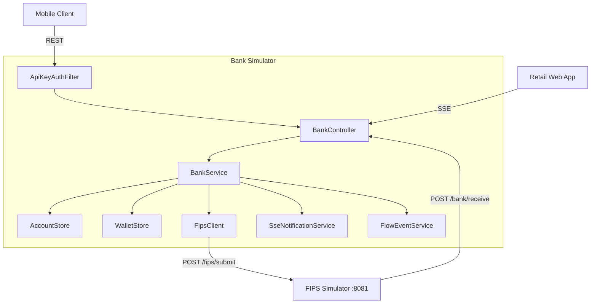
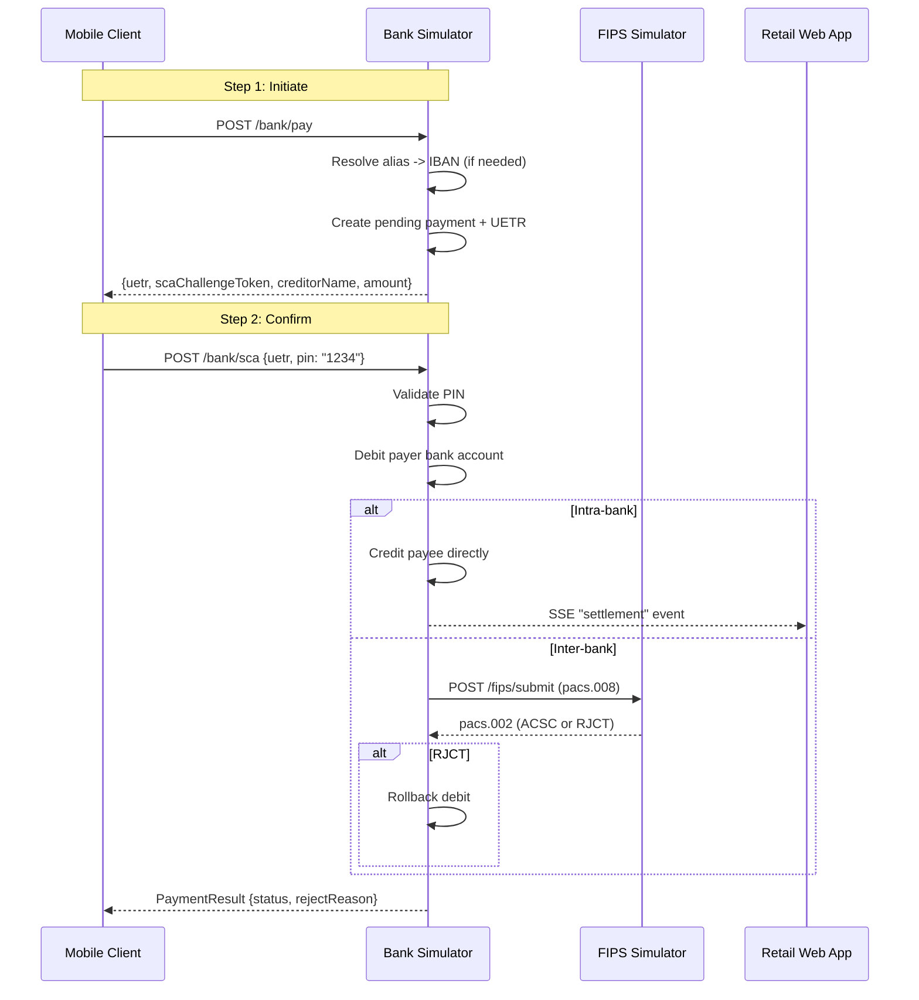
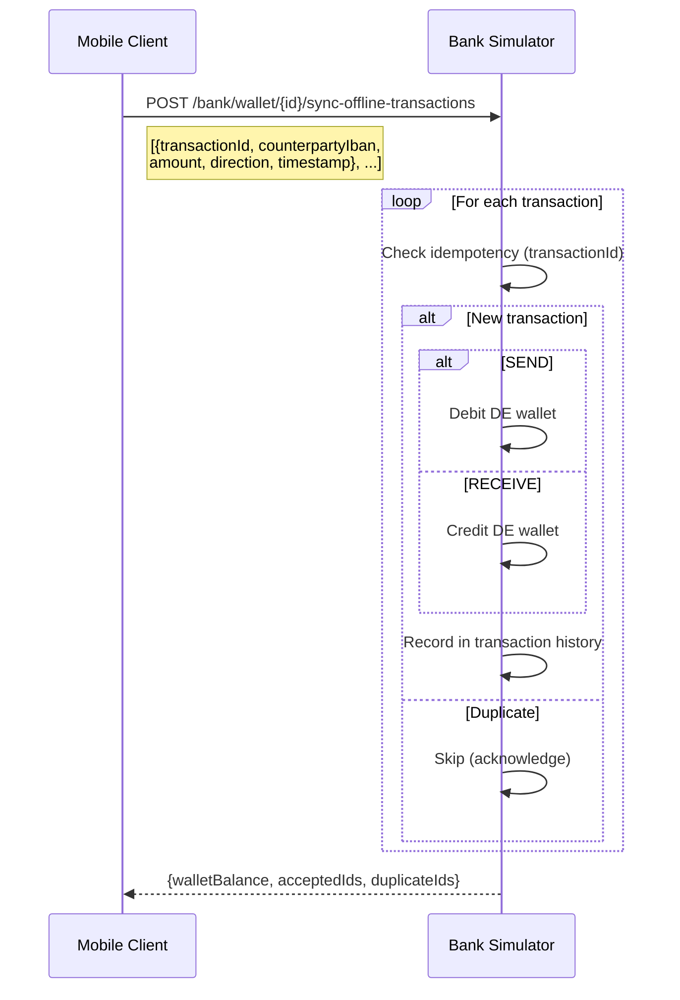

# Bank Simulator

The bank simulator acts as a PSP (Payment Service Provider) / commercial bank. It is the central hub through which all client applications interact with the payment system. It manages accounts, balances, Digital Euro wallets, and orchestrates the full payment lifecycle including SCA, settlement, and FIPS integration.

## Tech Stack

- Java 21, Spring Boot 3.4.4
- Prowide ISO 20022 library for pacs.008 / pacs.002 message handling
- In-memory state (`ConcurrentHashMap`)
- Port: **8080**

## Internal Architecture

## API Endpoints

All endpoints require `X-Api-Key` header (or `?apiKey=` query param) unless noted.

### Account Management

| Method | Path | Description |
|--------|------|-------------|
| `POST` | `/bank/register` | Register a new consumer or merchant account |
| `GET` | `/bank/accounts/{iban}` | Account details + recent transactions |
| `GET` | `/bank/proxy?alias={phone}` | Resolve phone/email alias to IBAN + holder name |
| `GET` | `/bank/vop?iban={}&name={}` | Verification of Payee (MATCH / CLOSE_MATCH / NO_MATCH) |
| `GET` | `/bank/transactions/{iban}` | Transaction history (retailer polls for settlement) |

### Digital Euro Wallet

| Method | Path | Description |
|--------|------|-------------|
| `GET` | `/bank/wallet/{walletId}` | Wallet balance |
| `POST` | `/bank/wallet/{walletId}/topup` | Move funds bank -> DE wallet |
| `POST` | `/bank/wallet/{walletId}/redeem` | Move funds DE wallet -> bank |
| `POST` | `/bank/wallet/{walletId}/sync-offline-transactions` | Reconcile offline NFC transfers (idempotent) |

### Payment Flow

| Method | Path | Description |
|--------|------|-------------|
| `POST` | `/bank/pay` | Step 1: Initiate payment, receive SCA challenge |
| `POST` | `/bank/sca` | Step 2: Confirm SCA (PIN), trigger settlement |
| `POST` | `/bank/receive` | **No auth.** FIPS forwards pacs.008 to credit payee |

### Request-to-Pay (Stretch)

| Method | Path | Description |
|--------|------|-------------|
| `POST` | `/bank/request-to-pay` | Merchant creates RTP targeting payer alias |
| `GET` | `/bank/incoming-rtp/{iban}` | Payer polls for pending RTPs |
| `GET` | `/bank/rtp-status/{rtpId}` | Merchant polls for RTP settlement status |

### Server-Sent Events

| Method | Path | Description |
|--------|------|-------------|
| `GET` | `/bank/payment-events/{creditorRef}` | Settlement/rejection notifications scoped by creditor reference |
| `GET` | `/bank/flow-events` | **No auth.** All payment flow events for visualizer |

## Payment Orchestration

### Two-Step Payment Flow

### Settlement Logic

1. **Debit** the payer's bank balance
2. **Route** based on whether payer and payee are on the same bank:
   - **Intra-bank**: Credit payee directly, emit SSE settlement event
   - **Inter-bank**: Build pacs.008, submit to FIPS, await pacs.002 response
3. **On FIPS rejection**: Rollback the debit, return rejection code to client
4. **Record** transaction on both payer and payee accounts

### Offline NFC Sync

## Data Model

### Account

| Field | Type | Description |
|-------|------|-------------|
| `iban` | String | Primary identifier |
| `holderName` | String | Display name |
| `phoneAlias` | String | Phone number (consumers only) |
| `accountType` | AccountType | CONSUMER / MERCHANT |
| `bankBalance` | BigDecimal | Commercial bank balance |
| `walletId` | UUID | Linked DE wallet (consumers only) |
| `transactions` | List | Recent transaction history (last 20) |

### DigitalEuroWallet

| Field | Type | Description |
|-------|------|-------------|
| `walletId` | UUID | Primary identifier |
| `ownerIban` | String | Linked bank account IBAN |
| `balance` | BigDecimal | Digital Euro balance |

### Transaction

| Field | Type | Description |
|-------|------|-------------|
| `uetr` | UUID | Unique payment identifier |
| `debtorIBAN` / `creditorIBAN` | String | Payer / payee accounts |
| `debtorName` / `creditorName` | String | Display names |
| `amount` | BigDecimal | EUR amount |
| `status` | TransactionStatus | RCVD / ACSP / ACSC / RJCT |
| `rejectReason` | String | ISO 20022 code (e.g., AM04) |
| `creditorReference` | String | ISO 11649 reference (from QR) |
| `remittanceInfo` | String | Unstructured text |
| `settledAt` | Instant | Settlement timestamp |

### RequestToPay

| Field | Type | Description |
|-------|------|-------------|
| `rtpId` | UUID | Primary identifier |
| `creditorIBAN` | String | Merchant IBAN |
| `debtorIBAN` | String | Resolved payer IBAN |
| `amount` | BigDecimal | Requested amount |
| `status` | RtpStatus | PENDING / ACCEPTED / SETTLED / REJECTED / EXPIRED |

## Pre-Seeded Test Data

### Bank A (IBAN prefix `DE89370400440532013`)

| Name | IBAN | Phone | Bank Balance | Digital Euro |
|------|------|-------|-------------|--------------|
| Alice Consumer | ...013001 | +49111000001 | EUR 1,000.00 | EUR 50.00 |
| Bob Consumer | ...013002 | +49111000002 | EUR 500.00 | EUR 20.00 |
| MediaMarkt Saturn | ...013099 | — | EUR 0.00 | — |

### Bank B (IBAN prefix `DE89370400440532014`)

| Name | IBAN | Phone | Bank Balance | Digital Euro |
|------|------|-------|-------------|--------------|
| Charlie Consumer | ...014001 | +49222000001 | EUR 800.00 | EUR 30.00 |
| REWE Group | ...014099 | — | EUR 0.00 | — |

### Demo PINs

| PIN | User | Bank |
|-----|------|------|
| 1111 | Alice | Bank A |
| 2222 | Bob | Bank A |
| 4444 | Charlie | Bank B |

SCA confirmation always accepts PIN `1234`.

## Authentication

- **API key filter** on all endpoints except `/bank/receive`, `/bank/flow-events`, and `/actuator/*`
- Default key: `blinkpay-poc-key` (override via `BANK_API_KEY` env var)
- Key sent as `X-Api-Key` header or `?apiKey=` query parameter (fallback for SSE EventSource)

## Configuration

| Property | Default | Description |
|----------|---------|-------------|
| `server.port` | 8080 | HTTP listen port |
| `fips.base-url` | `http://localhost:8081` | FIPS simulator URL |
| `bank.api-key` | `blinkpay-poc-key` | API key for client auth |
| `bank.id` | `bank-a` | Bank identity for seeding |
| `bank.iban-prefix` | `DE89370400440532013` | IBAN prefix for generated accounts |
