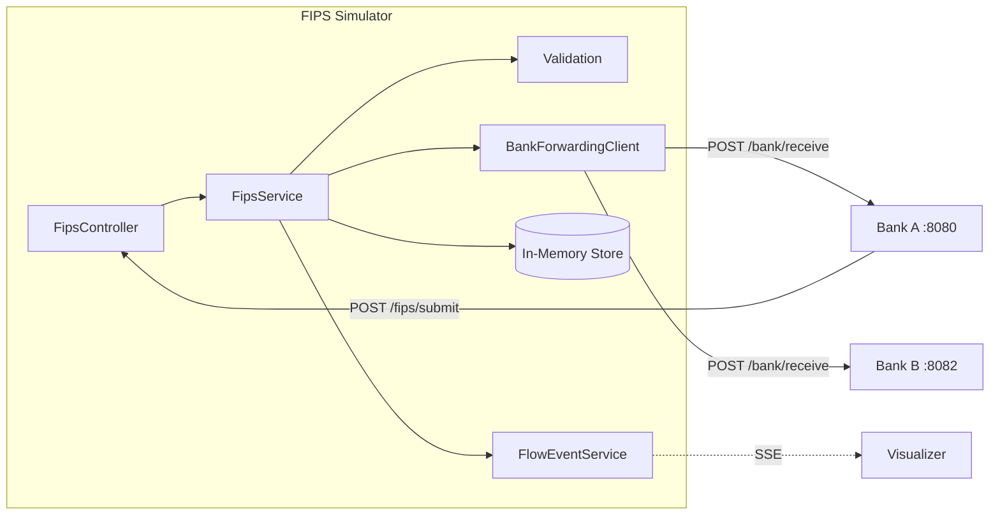
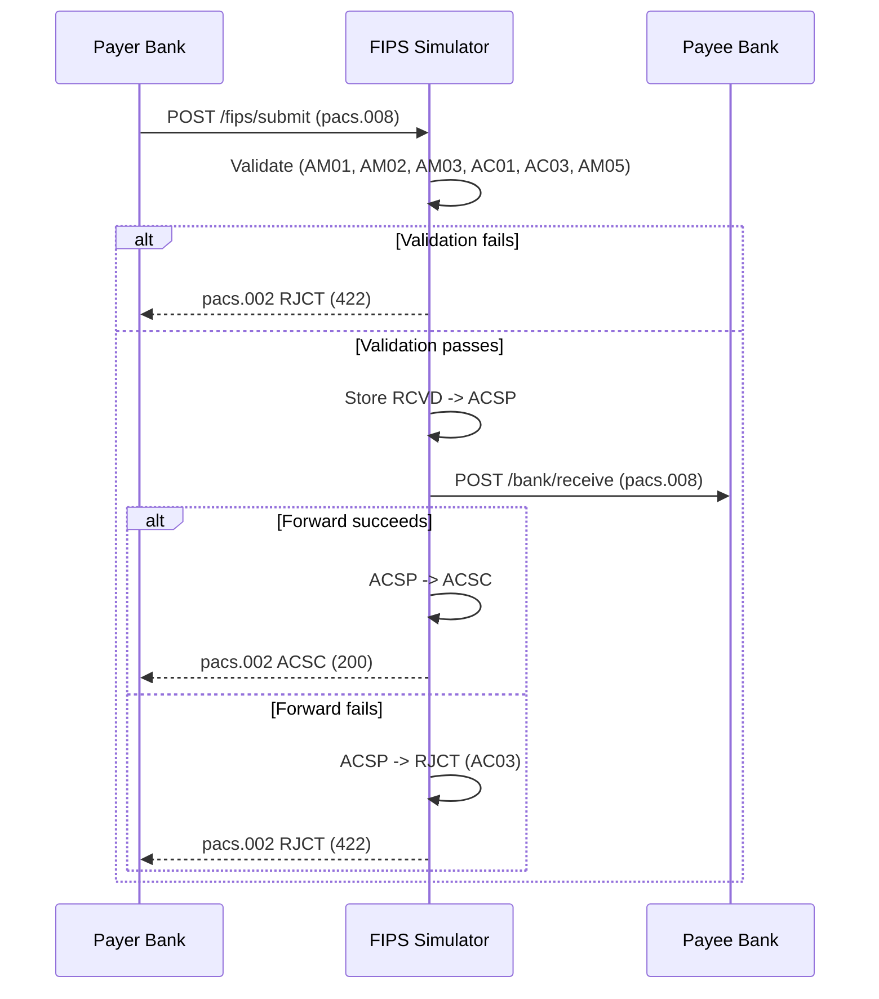

# FIPS Simulator

The FIPS (Fast Instant Payment System) simulator acts as a simplified TIPS/SCT Inst clearing network. It validates payment instructions against SCT Inst rules, routes them to the destination bank, and returns settlement status reports.

## Tech Stack

- Java 21, Spring Boot 3.4.4
- Prowide ISO 20022 library (`pw-iso20022`) for pacs.008 / pacs.002 message models
- In-memory state (`ConcurrentHashMap`)
- Port: **8081**

## Internal Architecture



## API Endpoints

| Method | Path | Request | Response | Status Codes |
|--------|------|---------|----------|--------------|
| `POST` | `/fips/submit` | `MxPacs00800108` | `MxPacs00200110` | 200 (ACSC), 422 (RJCT) |
| `GET` | `/fips/status/{uetr}` | UUID path param | `MxPacs00200110` | 200, 404 |
| `GET` | `/fips/transactions?limit=N` | Query param (1-500) | `List<TransactionView>` | 200 |
| `GET` | `/fips/flow-events` | — | SSE stream | 200 |

### POST /fips/submit

Main entry point. Accepts an ISO 20022 `pacs.008.001.08` payment instruction, validates it, forwards to the destination bank, and returns a `pacs.002.001.10` status report.

**Happy path:** Validate -> Store (RCVD) -> ACSP -> Forward to bank -> ACSC -> Return 200
**Rejection:** Validate fails -> Store (RJCT) -> Return 422

### GET /fips/status/{uetr}

Poll the current status of a previously submitted transaction by its UETR (Unique End-to-End Transaction Reference). Returns the cached pacs.002 response.

### GET /fips/transactions

Admin view returning recent transactions sorted newest-first. Accepts a `limit` query parameter (default 500, max 500).

## Validation Rules

Applied in order. First failure short-circuits with the corresponding reject code:

| Code | Rule | Description |
|------|------|-------------|
| AC01 | Missing/blank UETR or invalid UUID | Invalid transaction identifier |
| AM05 | UETR already exists in store | Duplicate payment |
| AC01 | Missing/blank debtor IBAN | Invalid debtor account |
| AC03 | Missing/blank creditor IBAN | Invalid creditor account |
| AM01 | Amount is null, zero, or negative | Invalid amount |
| AM02 | Amount exceeds EUR 100,000.00 | Exceeds SCT Inst limit |
| AM03 | Currency is not "EUR" | Non-EUR currency |

## Settlement Lifecycle



## Bank Routing

The FIPS simulator routes payments to destination banks based on the creditor IBAN prefix. Routing is configured via `application.properties`:

```properties
fips.banks[0].prefix=DE89370400440532013
fips.banks[0].url=http://localhost:8080

fips.banks[1].prefix=DE89370400440532014
fips.banks[1].url=http://localhost:8082
```

The `BankForwardingClient` matches the creditor IBAN against these prefixes and forwards the pacs.008 to `{bank-url}/bank/receive`.

In Docker, routing is overridden via environment variables:
- `FIPS_BANKS_0_URL=http://bank-a:8080`
- `FIPS_BANKS_1_URL=http://bank-b:8080`

## Data Model

### Transaction (mutable)

| Field | Type | Description |
|-------|------|-------------|
| `uetr` | UUID | Unique End-to-End Transaction Reference |
| `debtorIBAN` | String | Payer account |
| `creditorIBAN` | String | Payee account |
| `amount` | BigDecimal | Payment amount |
| `currency` | String | ISO 4217 (always "EUR") |
| `debtorName` | String | Payer display name |
| `creditorName` | String | Payee display name |
| `endToEndId` | String | Reference from pacs.008 |
| `status` | TransactionStatus | RCVD / ACSP / ACSC / RJCT |
| `settledAt` | Instant | Timestamp when ACSC reached |
| `rejectReason` | String | ISO 20022 reject code if RJCT |
| `createdAt` | Instant | Timestamp of receipt |

### TransactionStatus (enum)

- `RCVD` — Received, awaiting processing
- `ACSP` — Accepted, settlement in process (routing to creditor bank)
- `ACSC` — Accepted, settlement completed (irrevocable)
- `RJCT` — Rejected

## Configuration

| Property | Default | Description |
|----------|---------|-------------|
| `server.port` | 8081 | HTTP listen port |
| `fips.banks[N].prefix` | — | IBAN prefix for routing |
| `fips.banks[N].url` | — | Bank base URL |

CORS is open (all origins allowed) for the POC.
