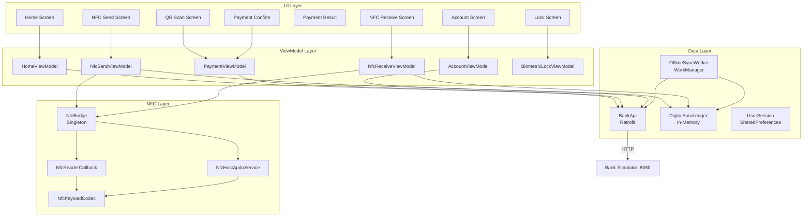
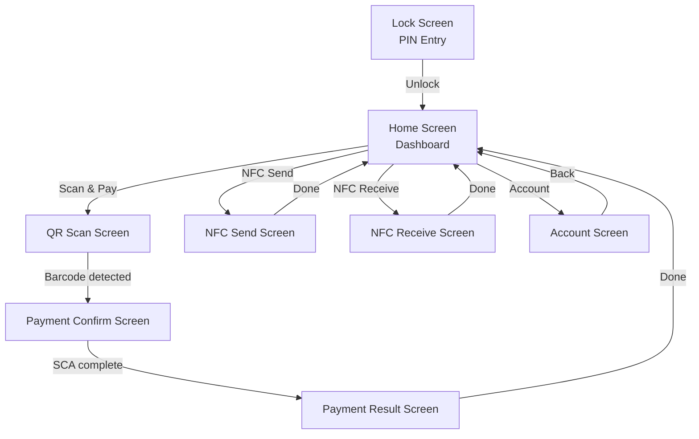
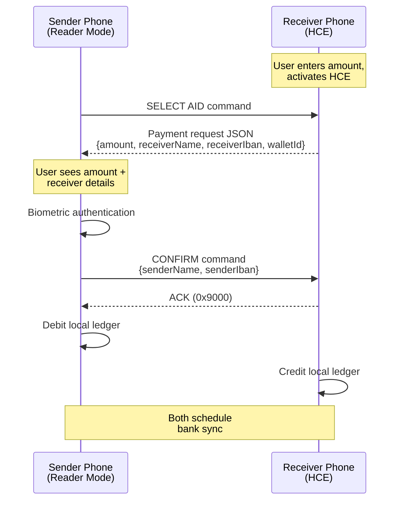
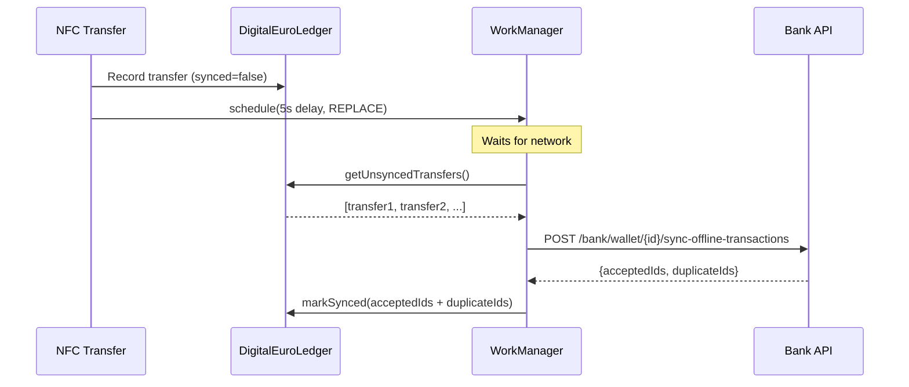

# Mobile Client

The mobile client is a native Android wallet app for consumers. It supports QR-based merchant payments, peer-to-peer transfers via phone alias, offline NFC Digital Euro transfers, and wallet management.

## Tech Stack

- Kotlin, Android API 26+ (Android 8.0)
- Jetpack Compose (Material 3) for UI
- MVVM architecture with ViewModel + StateFlow
- Retrofit 2 + OkHttp for REST API calls
- CameraX + ML Kit Barcode Scanning for QR
- NFC ISO-DEP (Host Card Emulation + Reader Mode)
- WorkManager for offline sync
- Jetpack Navigation for screen routing

## Architecture

## Screens and Navigation

### Screen Details

| Screen | Purpose | ViewModel |
|--------|---------|-----------|
| **Lock Screen** | PIN entry (1111=Alice, 2222=Bob, 4444=Charlie). Sets `UserSession` with IBAN, wallet ID, bank URL. | `BiometricLockViewModel` |
| **Home Screen** | Dashboard with bank balance, DE wallet balance, and action card grid (Scan & Pay, NFC Send, NFC Receive, Account). | `HomeViewModel` |
| **QR Scan Screen** | Camera preview with ML Kit barcode detection. Parses EPC069-12 GiroCode QR data. | — |
| **Payment Confirm** | Shows payment details (amount, creditor, reference). Calls `POST /bank/pay` then `POST /bank/sca`. | `PaymentViewModel` |
| **Payment Result** | Success (green check, UETR) or failure (red X, human-readable error). | — |
| **NFC Send Screen** | Tap to pay. NFC reader mode reads payment request, sender authenticates with biometrics, sends confirmation. | `NfcSendViewModel` |
| **NFC Receive Screen** | Enter amount, activate HCE card emulation, wait for sender tap. | `NfcReceiveViewModel` |
| **Account Screen** | View balances, top-up DE wallet from bank, redeem DE wallet to bank. | `AccountViewModel` |

## API Integration

All calls go through `BankApi` (Retrofit interface) via `ApiClient` singleton. API key is injected via OkHttp interceptor.

| Method | Endpoint | Used By |
|--------|----------|---------|
| `GET` | `/bank/accounts/{iban}` | HomeViewModel, AccountViewModel |
| `GET` | `/bank/wallet/{walletId}` | HomeViewModel, AccountViewModel |
| `POST` | `/bank/wallet/{walletId}/topup` | AccountViewModel |
| `POST` | `/bank/wallet/{walletId}/redeem` | AccountViewModel |
| `POST` | `/bank/pay` | PaymentViewModel |
| `POST` | `/bank/sca` | PaymentViewModel |
| `POST` | `/bank/wallet/{walletId}/sync-offline-transactions` | OfflineSyncWorker |

## NFC Peer-to-Peer Architecture

The NFC subsystem enables offline Digital Euro transfers between two phones without network connectivity.

### Protocol

- Transport: ISO-DEP (ISO 14443-4) over NFC
- Custom AID: `F0424C4E4B504159` ("BlinkPay" in hex)
- Payload encoding: JSON via Gson, wrapped in APDU commands
- Status words: `0x9000` (success), `0x6A82` (no data available)

### Flow

### Components

| Component | Role |
|-----------|------|
| `NfcBridge` | Thread-safe singleton bridging HCE/Reader binder threads to UI coroutines via StateFlow |
| `NfcHostApduService` | Android HCE service responding to reader commands as an emulated card |
| `NfcReaderCallback` | NFC reader mode callback that discovers tags and exchanges APDUs |
| `NfcPayloadCodec` | JSON serialization/deserialization of APDU payloads |
| `BiometricHelper` | AndroidX Biometric wrapper for fingerprint/device credential prompts |

## Offline Sync

After each NFC transfer, the app schedules a bank sync via WorkManager:

### DigitalEuroLedger

In-memory singleton tracking all offline transfers:

| Field | Type | Description |
|-------|------|-------------|
| `transactionId` | String (UUID) | Unique identifier, used as idempotency key |
| `counterpartyName` | String | Other party's display name |
| `counterpartyIban` | String | Other party's IBAN |
| `amount` | BigDecimal | Transfer amount |
| `isSend` | Boolean | true = debit, false = credit |
| `synced` | Boolean | Whether bank has acknowledged this transfer |
| `timestamp` | Long | Epoch millis |

### OfflineSyncWorker

- **Trigger**: Enqueued after each NFC send/receive with 5-second initial delay
- **Policy**: `ExistingWorkPolicy.REPLACE` (coalesces rapid transfers)
- **Constraints**: Requires network connectivity
- **Retry**: Exponential backoff (30s base) on failure
- **Idempotency**: Server deduplicates by `transactionId`; both accepted and duplicate IDs are marked as synced

## Session Management

`UserSession` persists the active user identity in SharedPreferences:

| Field | Source |
|-------|--------|
| `iban` | Set on PIN login (hardcoded per demo user) |
| `holderName` | Set on PIN login |
| `phoneAlias` | Set on PIN login |
| `walletId` | Set on PIN login |
| `bankBaseUrl` | Set on PIN login (Bank A or Bank B URL) |

The app locks when returning from background, requiring PIN re-entry.
