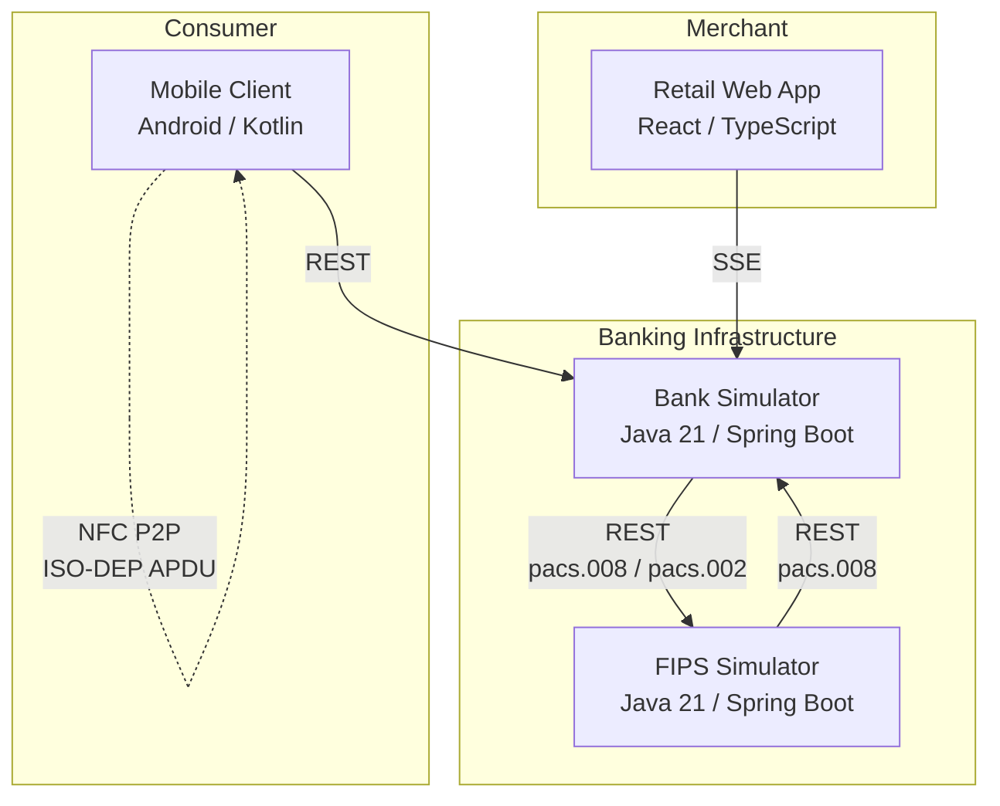
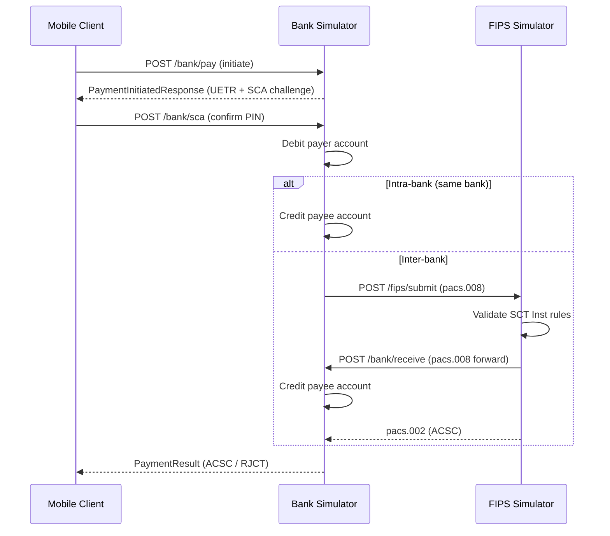
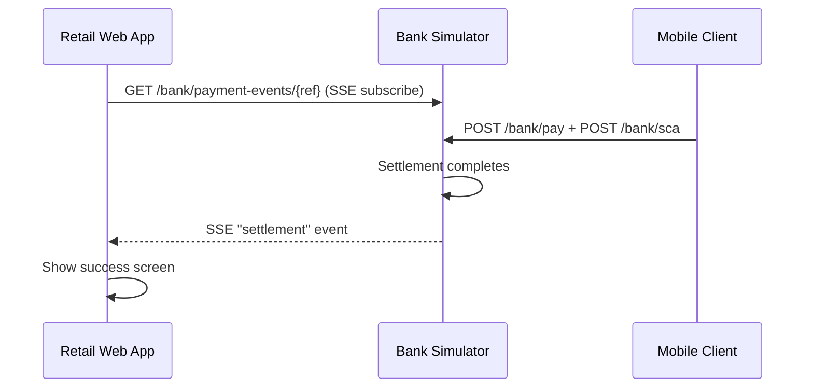
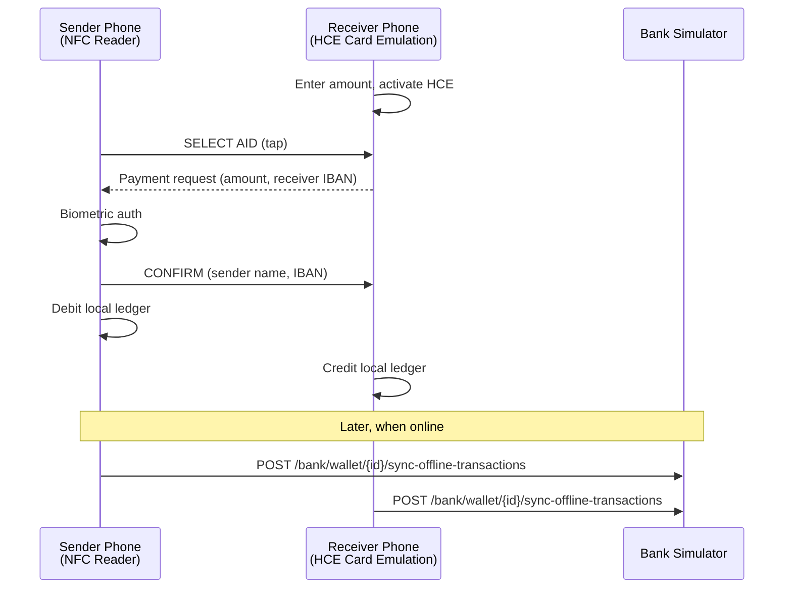
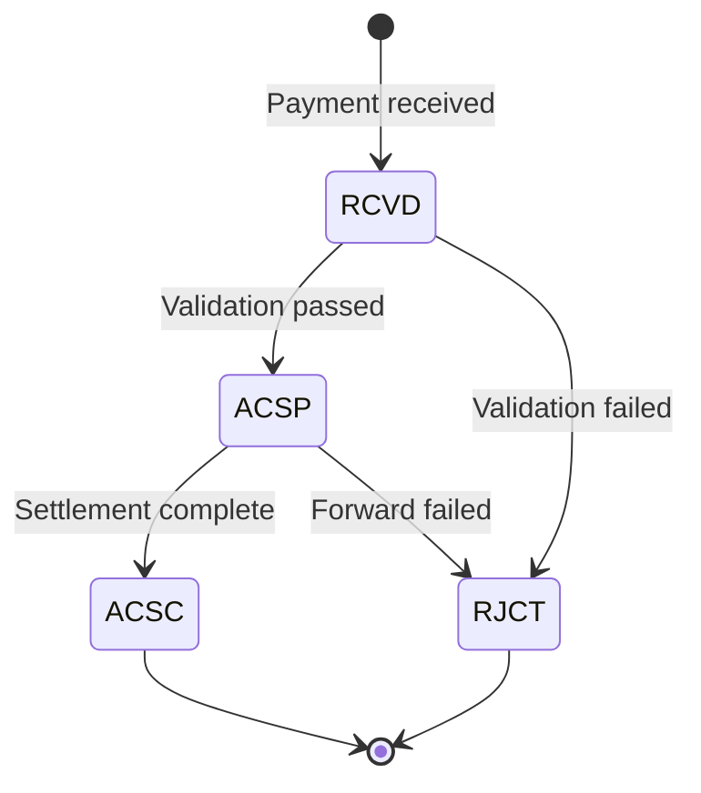

# Architecture Overview

## System Context

BlinkPay is a proof-of-concept for **SEPA Instant Payments (FIPS)** with **Digital Euro wallet** support. It demonstrates end-to-end instant payment flows between consumers, merchants, and banks within the EU regulatory framework (EU Regulation 2024/886).

The system consists of four components that communicate over HTTP REST and Server-Sent Events (SSE):

## Components

| Component | Stack | Port | Role |
|-----------|-------|------|------|
| **FIPS Simulator** | Java 21, Spring Boot 3.4 | 8081 | Simulated TIPS/SCT Inst clearing network. Validates and routes ISO 20022 payment messages between banks. |
| **Bank Simulator** | Java 21, Spring Boot 3.4 | 8080 | Simulated PSP/bank. Manages accounts, balances, proxy lookup, VoP, SCA, Digital Euro wallets, and payment orchestration. |
| **Retail Web App** | React 19, TypeScript, Vite | 3001 | Merchant POS terminal. Generates EPC069-12 QR codes and receives real-time settlement notifications via SSE. |
| **Mobile Client** | Android (API 26+), Kotlin, Jetpack Compose | N/A | Consumer wallet app. QR scanning, P2P payments, NFC offline transfers, Digital Euro wallet management. |

## Communication Patterns

### REST (Synchronous)

All inter-component communication flows through the bank simulator. The mobile client and retail web app never call the FIPS simulator directly.

### SSE (Push Notifications)

The bank simulator pushes real-time events to the retail web app when a payment settles against a specific creditor reference.

### NFC Peer-to-Peer (Offline)

Two mobile devices transfer Digital Euro balances offline via NFC ISO-DEP APDU, then sync with the bank when connectivity is available.

## Payment Flows

### Flow B1: Merchant QR Payment (MVP)

1. Merchant POS generates QR code with creditor IBAN, amount, and reference
2. POS subscribes to SSE settlement events for that reference
3. Consumer scans QR with mobile app
4. Consumer confirms payment (SCA with PIN)
5. Bank settles the payment (intra-bank or via FIPS)
6. POS receives SSE notification and shows success

### Flow B2: Request-to-Pay (Stretch)

1. Merchant calls `POST /bank/request-to-pay` targeting payer by alias
2. Payer polls `GET /bank/incoming-rtp/{iban}` for pending RTPs
3. Payer confirms via `POST /bank/sca` with the RTP ID
4. Merchant polls `GET /bank/rtp-status/{rtpId}` for settlement

### P2P Transfer via Alias

1. Consumer enters recipient phone number
2. Bank resolves alias to IBAN via proxy lookup
3. VoP check confirms name match
4. Consumer confirms payment (SCA)
5. Bank debits payer, credits payee (intra-bank or via FIPS)

### Offline NFC P2P Transfer

1. Receiver enters amount and activates HCE
2. Sender taps phone, reads payment request via NFC
3. Sender authenticates with biometrics
4. Both devices update local Digital Euro ledger
5. WorkManager schedules bank sync when connectivity is available (idempotent)

## Authentication

| Boundary | Mechanism |
|----------|-----------|
| Client-to-Bank | API key (`X-Api-Key` header or `?apiKey=` query param) |
| Bank-to-FIPS | None (internal network in POC) |
| FIPS-to-Bank (`/bank/receive`) | Exempted from API key check (internal) |
| SCA (user identity) | Stub PIN (`1234` accepted for all users) |
| NFC transfer | Biometric prompt (fingerprint / device credential) |

## Data Storage

All state is **in-memory only** (no database). Data is lost on service restart. Each service uses `ConcurrentHashMap` for thread-safe storage of accounts, wallets, transactions, and pending payments.

## ISO 20022 Messages

The system uses simplified JSON representations of ISO 20022 messages, modeled with the [Prowide ISO 20022](https://github.com/prowide/prowide-iso20022) library:

| Message | Direction | Purpose |
|---------|-----------|---------|
| `pacs.008.001.08` | Bank -> FIPS -> Bank | Payment instruction (credit transfer) |
| `pacs.002.001.10` | FIPS -> Bank | Payment status report (ACSC / RJCT) |

## Transaction Lifecycle

**Rejection codes** (ISO 20022):
- `AM01` — Zero or negative amount
- `AM02` — Exceeds EUR 100,000 limit
- `AM03` — Non-EUR currency
- `AM04` — Insufficient funds
- `AM05` — Duplicate UETR
- `AC01` — Invalid debtor IBAN / UETR
- `AC03` — Invalid creditor IBAN
