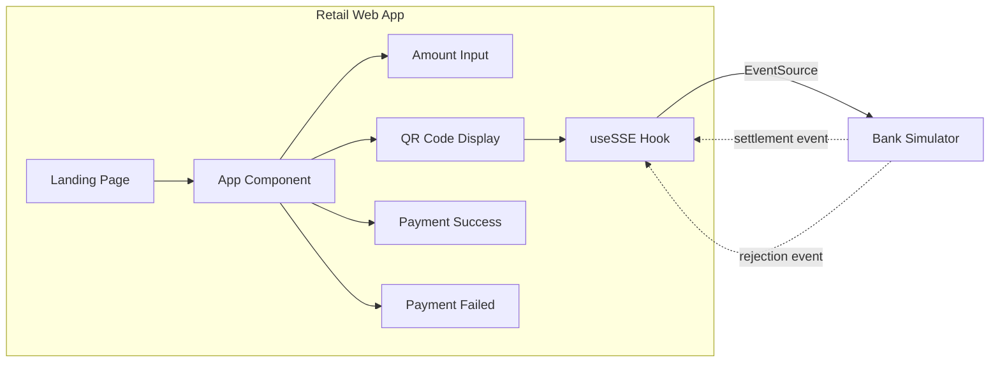
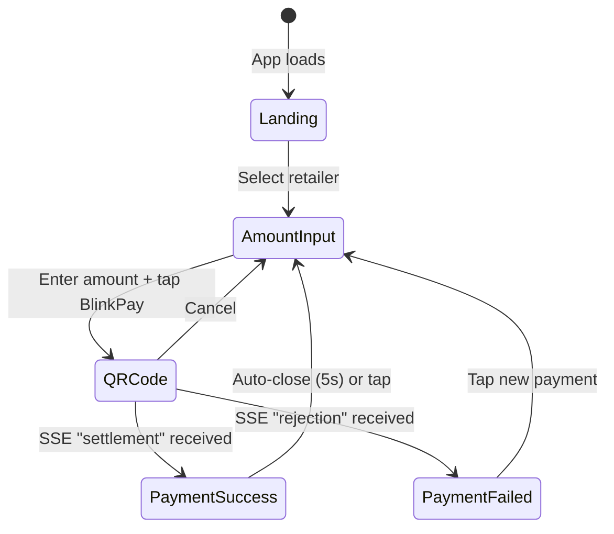
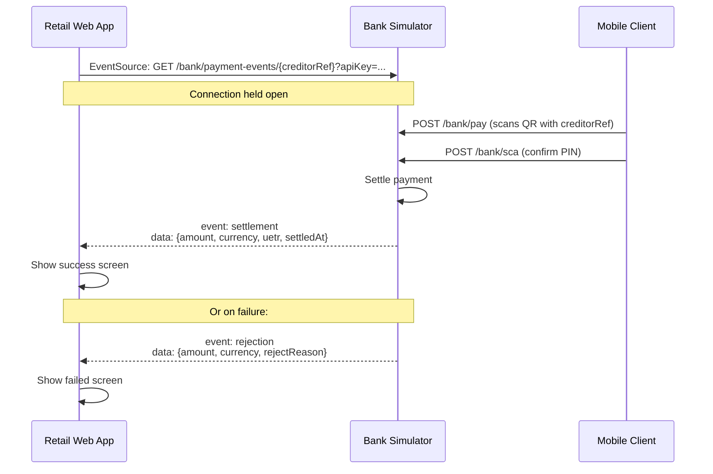

# Retail Web App

The retail web app is a browser-based Point-of-Sale (POS) terminal for merchants. It generates EPC069-12 (GiroCode) QR codes for SEPA Instant payments and receives real-time settlement notifications via Server-Sent Events.

## Tech Stack

- React 19, TypeScript 5.9
- Vite 8 (build tool)
- `qrcode.react` for QR code generation
- Server-Sent Events (SSE) for real-time settlement notifications
- Port: **3001** (dev), **80** (Docker/Nginx)

## Architecture



## Screens



### Screen Details

| Screen | Purpose |
|--------|---------|
| **Landing Page** | Retailer selector (MediaMarkt Saturn or REWE Group). Sets IBAN, bank URL, and accent color. |
| **Amount Input** | Virtual numpad for entering payment amount. Two payment method buttons: Card (disabled) and BlinkPay (active). |
| **QR Code Display** | Generates and displays EPC069-12 QR code. Shows connection status to bank. Includes "Simulate Payment" button for dev testing. |
| **Payment Success** | Green checkmark, settled amount, timestamp. Auto-closes after 5 seconds with progress bar. |
| **Payment Failed** | Red X icon with human-readable rejection reason (AM04, AC01, AG01, DUPL). |

## QR Code Format

The app generates EPC069-12 (GiroCode) QR codes compatible with SEPA payment standards:

```
BCD                          # Service Tag
002                          # Version
1                            # Character Set (UTF-8)
SCT                          # Identification (SEPA Credit Transfer)
                             # BIC (empty for POC)
{creditorName}               # Beneficiary Name
{creditorIBAN}               # Beneficiary IBAN
EUR{amount}                  # Amount
                             # Purpose (empty)
{creditorReference}          # ISO 11649 Structured Reference
{remittanceInfo}             # Unstructured Remittance Info
```

The creditor reference is a UUID generated per payment session, used to scope SSE settlement notifications.

## Bank Integration

The retail web app communicates with the bank simulator exclusively via **Server-Sent Events** (no REST calls from the app itself). The payment is initiated by the consumer's mobile client, not the POS.

### SSE Connection



### SSE Event Types

| Event | Fields | Trigger |
|-------|--------|---------|
| `settlement` | `amount`, `currency`, `uetr`, `settledAt` | Payment with matching creditor reference settles successfully |
| `rejection` | `amount`, `currency`, `rejectReason` | Payment with matching creditor reference is rejected |

### Error Handling

- Auto-retries up to 3 times with 2-second delay on connection failure
- UI shows connection status: connected (green), disconnected (orange), error
- Gracefully handles malformed SSE messages (JSON parse errors)

## Retailer Configuration

The app supports multiple retailer terminals via URL hash routing:

| Hash | Retailer | IBAN | Bank | Accent Color |
|------|----------|------|------|-------------|
| `#mms` | MediaMarkt Saturn | DE89370400440532013099 | Bank A (:8080) | Red `#e3000f` |
| `#rew` | REWE Group | DE89370400440532014099 | Bank B (:8082) | Blue `#005CA9` |

Each retailer connects to its own bank simulator instance and displays its branding (name + accent color) in the POS terminal UI.

## Configuration

Environment variables (baked in at build time via Vite):

| Variable | Default | Description |
|----------|---------|-------------|
| `VITE_BANK_API_KEY` | `blinkpay-poc-key` | API key for SSE authentication |
| `VITE_BANK_A_BASE_URL` | `http://localhost:8080` | Bank A simulator URL |
| `VITE_BANK_B_BASE_URL` | `http://localhost:8082` | Bank B simulator URL |

## Deployment

- **Development**: `npm run dev` starts Vite dev server on port 3001
- **Production**: Multi-stage Docker build (Node for build, Nginx Alpine for serving static files on port 80)
